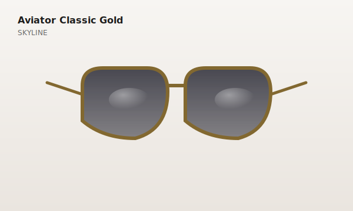

# Lumea — Virtual Eyewear Try-On (Frontend-Only Prototype)

A modern, premium optical shop prototype that lets customers **virtually try on sunglasses and prescription glasses directly in the browser**. Built with HTML5, CSS3, vanilla ES6 JavaScript, [A-Frame](https://aframe.io/) and [MediaPipe Face Landmarker](https://developers.google.com/mediapipe/solutions/vision/face_landmarker). 100% client-side — no backend, no build tools, deployable on GitHub Pages.



---

## ✨ Features

| Area | What you get |
|------|--------------|
| **Home page** | Premium hero, featured sunglasses, featured prescription, categories, how-it-works, fully responsive nav |
| **Catalog** | 12 sample products loaded from local `products.json`, search, multi-filter (category / gender / brand), sort |
| **Virtual try-on** | Live webcam **or** uploaded photo, MediaPipe face tracking (478 landmarks), real-time 3D glasses positioning |
| **A-Frame scene** | Transparent overlay, ambient + directional lighting, PBR materials, responsive canvas |
| **User controls** | Prev / Next frame · Zoom +/– · Rotate L/R · Raise / Lower · Reset |
| **Camera controls** | Open · Close · Switch front/rear (mobile) · Upload photo · Capture photo · Save image (PNG) |
| **Screenshot** | Composites camera frame + A-Frame canvas via Canvas API → PNG download (100% local) |
| **Performance** | Lazy-loaded MediaPipe, model cache, single shared WebGL context, 30–60 FPS target |
| **Responsive** | Desktop / tablet / Android / iPhone, portrait & landscape |
| **GitHub Pages ready** | Pure static files, relative paths, no build step |

---

## 🗂 Project structure

```
optical-shop/
├── index.html              # Home page
├── catalog.html            # Product catalog
├── tryon.html              # Virtual try-on (A-Frame + MediaPipe)
├── README.md
├── assets/
│   ├── products.json       # Local product database
│   ├── css/
│   │   └── main.css        # Shared stylesheet (premium minimal theme)
│   ├── images/             # SVG product thumbnails (one per product)
│   └── models/             # Reserved for future .glb files
└── js/
    ├── home.js             # Home page controller
    ├── catalog.js          # Catalog page controller
    ├── tryon.js            # Try-on orchestrator (wires all modules)
    └── modules/
        ├── productLoader.js  # JSON fetch + cache + filter/search
        ├── ui.js             # Toasts, modals, nav toggle, product card
        ├── camera.js         # getUserMedia + photo upload + capture
        ├── mediapipe.js      # FaceLandmarker wrapper → head-pose events
        ├── scene.js          # A-Frame mount, procedural glasses, rig
        └── screenshot.js     # Compose camera + 3D → PNG download
```

---

## 🚀 Run locally

Because the project uses **ES6 modules**, you must serve it over HTTP (not `file://`).

Any static server works:

```bash
# Python 3 (built-in)
cd optical-shop
python3 -m http.server 8080
# → http://localhost:8080

# Or: Node http-server
npx http-server -p 8080

# Or: VS Code Live Server extension
```

Open <http://localhost:8080> in any modern browser (Chrome / Edge / Firefox / Safari).

---

## 🌐 Deploy to GitHub Pages

1. Push the entire `optical-shop/` folder to a GitHub repository (e.g. `my-lumea-shop`).
2. In the repo, go to **Settings → Pages**.
3. Under **Build and deployment → Source**, choose **Deploy from a branch**.
4. Select branch `main`, folder `/root`, then **Save**.
5. Wait ~30 seconds, then visit:
   `https://<your-username>.github.io/<repo-name>/`

All asset paths are relative (`assets/…`, `js/…`) so no configuration is needed.

---

## 🧠 How virtual try-on works

```
┌─────────────┐   ┌──────────────────┐   ┌──────────────────┐   ┌─────────────┐
│ Camera /    │──▶│ MediaPipe Face   │──▶│  A-Frame Scene   │──▶│  <canvas>   │
│ Photo frame │   │ Landmarker (478) │   │  (glasses-rig)   │   │  (overlay)  │
└─────────────┘   └──────────────────┘   └──────────────────┘   └─────────────┘
                          │                        ▲                      │
                          │ pose { eyeMid, scale,  │                      │
                          │   roll, yaw, pitch }   │                      ▼
                          └────────────────────────┘               Screenshot:
                                                                    camera + 3D → PNG
```

1. **CameraManager** (`camera.js`) captures a frame (from webcam or uploaded photo) into an off-screen canvas.
2. **MediaPipeFaceTracker** (`mediapipe.js`) runs `FaceLandmarker.detectForVideo()` in a `requestAnimationFrame` loop, then derives:
   - `eyeMid` — midpoint between the two eye centers (pixel coords)
   - `scale` — interpupillary distance in pixels (drives glasses size)
   - `roll / yaw / pitch` — head rotation in radians (computed from eye line + nose offset)
3. **TryOnScene** (`scene.js`) injects an A-Frame scene with a custom `glasses-rig` component that:
   - Smooths the incoming pose (exponential lerp, ~80 ms time constant)
   - Projects `eyeMid` from screen-space → world-space using the A-Frame camera FOV
   - Applies user manual offsets (zoom, rotate, raise/lower)
   - Mirrors the canvas via CSS so it matches the live-camera selfie view
4. Glasses models are built **procedurally** in A-Frame primitives (torus + cylinder + box) per model type — `aviator`, `wayfarer`, `cateye`, `round`, `sport`, `oversized`, `rectangle`, `square`, `oval`, `browline`. Models are cached and re-used.
5. **ScreenshotManager** (`screenshot.js`) composes the camera canvas with the A-Frame canvas (mirroring applied to both layers) and triggers a PNG download via `canvas.toDataURL('image/png')`. **No upload, no cloud.**

---

## 🔌 Adding real `.glb` 3D models

The prototype currently renders procedurally-built glasses. To use real GLB models:

1. Drop the file into `assets/models/` (e.g. `aviator-gold.glb`).
2. Edit `assets/products.json` — set the `model` field to the GLB path:
   ```json
   { "id": "sg-001", "model": "assets/models/aviator-gold.glb", … }
   ```
3. The loader (`scene.js → _buildGlasses`) automatically detects `.glb` URLs and uses A-Frame's `gltf-model` component. No code changes needed.

---

## 📋 Keyboard shortcuts (try-on page)

| Key | Action |
|-----|--------|
| ← / → | Previous / next frame |
| `+` / `–` | Zoom in / out |
| `R` | Reset position |

---

## 🛡 Privacy

* **No server, no database, no analytics.**
* Camera access is requested only when you click *Open Camera* — and the stream never leaves your device.
* Uploaded photos are processed entirely in-browser; no file is uploaded anywhere.
* The MediaPipe model is loaded once from `storage.googleapis.com` and runs locally via WebAssembly/GPU.

---

## 🧰 Tech stack

| Layer | Tech |
|-------|------|
| Markup & styles | HTML5, CSS3 (custom properties, grid, clamp, container queries) |
| Scripting | Vanilla ES6 modules (no framework, no bundler) |
| 3D rendering | [A-Frame 1.5](https://aframe.io/) (which wraps Three.js internally — we don't use Three.js directly) |
| Face tracking | [@mediapipe/tasks-vision](https://www.npmjs.com/package/@mediapipe/tasks-vision) 0.10.x — FaceLandmarker |
| Image composition | Native Canvas 2D API |

---

## 🌍 Browser support

Tested on the latest versions of Chrome, Edge, Firefox, and Safari. Camera + WebGL + WebAssembly required. On iOS Safari, the page must be served over **HTTPS** (GitHub Pages provides this for free).

---

## 📝 Notes & limitations

* The procedural glasses are intentionally simple (low-poly torus + cylinder + box). Drop in real GLB models for production-grade visuals — the loader is already wired.
* Head-pose yaw/pitch are derived geometrically (eye line + nose offset). For higher accuracy, the MediaPipe `facialTransformationMatrixes` is also captured in `pose.matrix` and ready for a more sophisticated solver.
* For best tracking: face the camera directly, ensure even lighting, keep your face within ~50 cm of the camera.

---

© 2025 Lumea Optical Atelier — a frontend prototype. All trademarks are illustrative.
